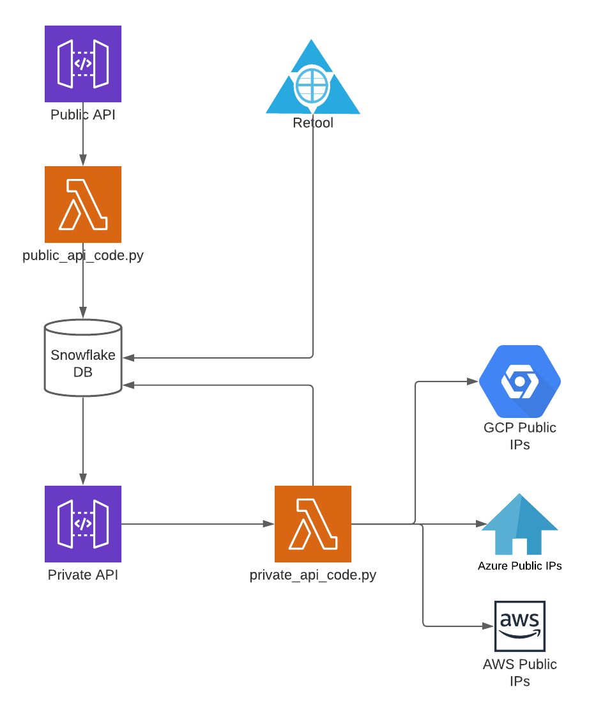

# csp-ip-lookup

## Quick Usage

Go to the following website and punch in the IP Address

https://catscrdl.retool.com/embedded/public/e927ef61-2853-4b36-9993-47fa7e6011d3

Or you can use a curl command to lookup multiple IP addresses

```
curl -X POST https://csp-ip-lookup.catscrdl.io/collectCSPsPublicAPI \
  --header 'Content-Type: application/json' \
  -d '{
    "ip_addresses": [
      "52.127.53.105",
      "35.134.66.241",
      "99.87.32.45"
    ]
}'
```

## Caching

You can choose to set an optional flag in the JSON body called "cached". If you set this to "y", then the lookup will use a cached value of the CSP IP ranges. This cache updates about every 15 minutes. If this value is "n" or otherwise omitted, it'll use a live lookup. The live lookup may be more accurate but it will also take longer.

```
curl -X POST https://csp-ip-lookup.catscrdl.io/collectCSPsPublicAPI \
  --header 'Content-Type: application/json' \
  -d '{
    "ip_addresses": [
      "52.127.53.105",
      "35.134.66.241",
      "99.87.32.45"
    ]
    , "cached": "y"
}'
```

## Output

Output is properly formatted JSON structured as follows:

```
[
  {
    "ip_address": ip_address,
    "data": {
      "cloud", cloud
      "region", [regions]|region,
      "service", [services]|service,
      "ip_range", [ip_ranges]|ip_range,
      "date",date
    }
  }
]
```

If one or more regions, services, or ranges match, the JSON object will return a list. If only one matches, it'll be a string.

## Diagram and Architecture

Snowflake serves as the center of the operation (I work at Snowflake, but I do really enjoy using it). I built an external function so that when I do `select collect_csp_cidr_ranges()`, the code in `private_api_code.py` runs and reaches out to various sources to pull the list of latest public IP addresses from the 3 major CSPs. Additionally, a task runs every 15 minutes to run this code and update a table (also stored in Snowflake).

Retool queries Snowflake directly and runs a query very similar to the one in public_api_code.py to search the public IP ranges.

The API uses AWS API Gateway to run `public_api_code.py` which uses the Snowflake REST API to query either thetable or call the external function.



## Credits

Aidan Steele (https://twitter.com/__steele) for a code review and the initial request

Paul Schwarzenberger (https://twitter.com/paulschwarzen) for feedback on the API output

You can find me at https://twitter.com/Daniel_Infosec